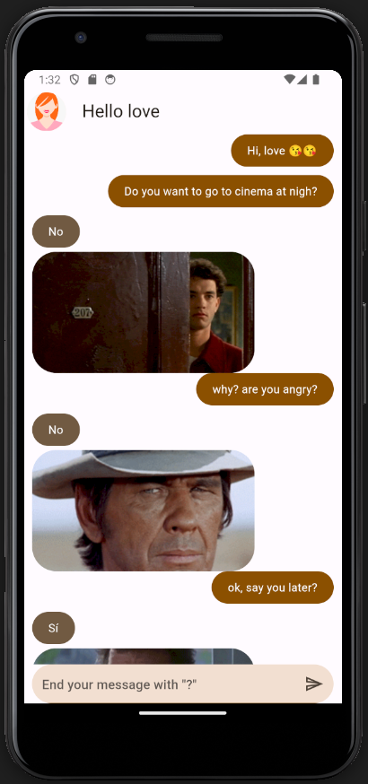

# Flutter Yes Nope App

Flutter Application as Part of Training using Provider, Fetching Data from a Basic API (https://yesno.wtf/) through a PODO using Dio. This app receives a question and responds with an image and the answer 'Yes' or 'Nope,' simulating a chat.

# Final result

This is the final result:

## How to run

Clone the repo and run: `flutter pub get` after that start emulator and run the main app.

## Packages used

Provider ^6.1.1

Dio ^5.4.0